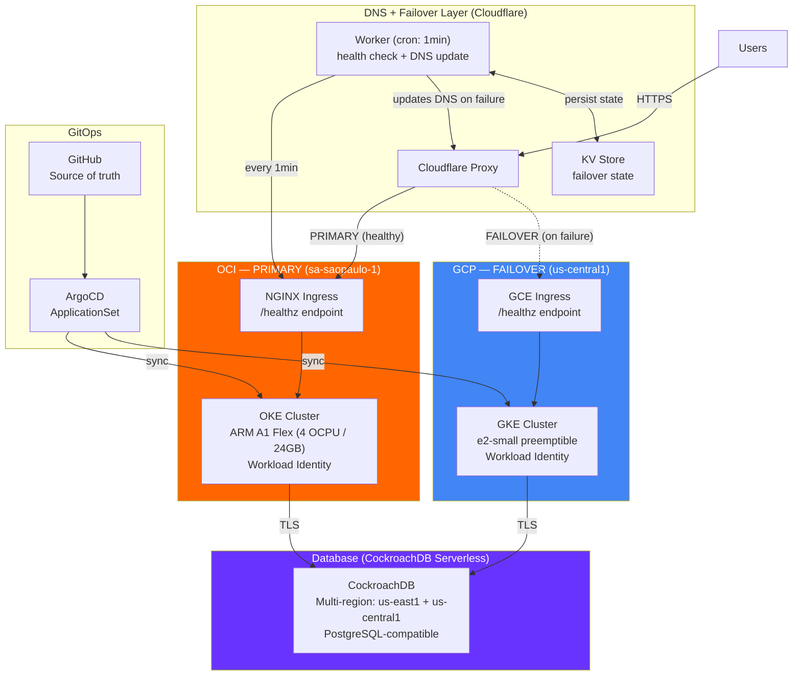
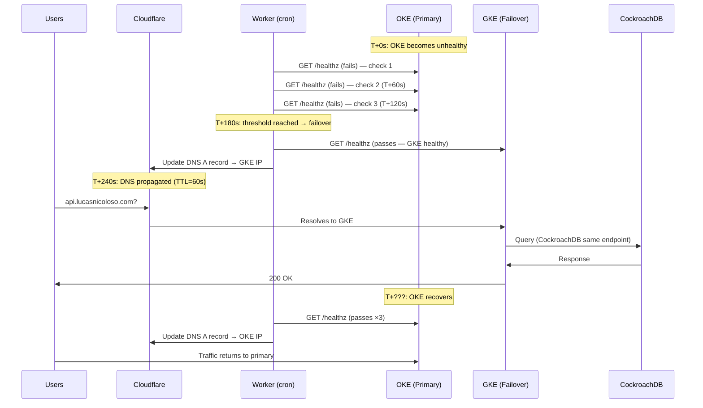
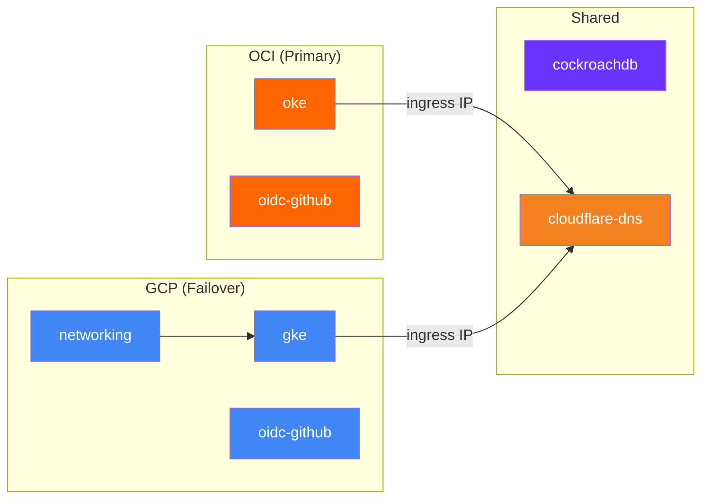

# Multi-Cloud Resilient Platform

> **TL;DR**: Active-passive multi-cloud failover with OKE/OCI (primary) and GKE/GCP (failover), automated DNS failover via Cloudflare Workers, GitOps deployment with ArgoCD, and OIDC-based CI/CD. RTO: ~4 minutes. Cost: ~R$20/month. Zero stored secrets.

[](https://github.com/lucasnicoloso/multi-cloud-portfolio/actions)
[](https://www.checkov.io/)
[](https://www.infracost.io/)

---

## Why Multi-Cloud?

Not for the resume. **For resilience.**

This project implements an active-passive failover pattern where OCI is the primary cloud and GCP is the warm standby. If OKE goes down, a Cloudflare Worker automatically redirects all traffic to GKE within ~4 minutes — no human intervention required.

The DNS failover layer runs on **Cloudflare, outside both clouds**, eliminating the single point of failure that would exist if AWS Route53 (an AWS service) were used to trigger failover away from AWS.

## Architecture



## Architectural Decisions & Trade-offs

| Decision | Choice | Trade-off |
|---|---|---|
| **Strategy** | Active-Passive (not Active-Active) | (+) Simple data model. (-) ~4 min outage during failover. [ADR-001](docs/adr/001-active-passive-strategy.md) |
| **Primary Cloud** | OCI OKE + ARM A1 Flex | (+) Free forever (4 OCPU/24GB). (-) Less market recognition than AWS. [ADR-001](docs/adr/001-active-passive-strategy.md) |
| **Failover Cloud** | GCP GKE + preemptible e2-small | (+) Free control plane. (-) Preemptible nodes can be reclaimed. [ADR-001](docs/adr/001-active-passive-strategy.md) |
| **Database** | CockroachDB Serverless (multi-region) | (+) True DB failover, free, PostgreSQL-compatible. (-) 50M RU/month limit. [ADR-005](docs/adr/005-data-strategy.md) |
| **DNS Failover** | Cloudflare Workers (outside both clouds) | (+) No cloud SPOF for DNS. (-) 1-min cron = ~4 min RTO. [ADR-007](docs/adr/007-dns-failover.md) |
| **Identity** | OIDC federation (GitHub → OCI/GCP) | (+) Zero stored secrets. (-) Bootstrap requires local auth. [ADR-004](docs/adr/004-oidc-federation.md) |
| **GitOps** | ArgoCD ApplicationSet | (+) Both clusters always in sync. (-) Another system to operate. [ADR-006](docs/adr/006-gitops-argocd.md) |

## What Happens When It Breaks

> Full runbook: [docs/runbooks/failover-scenario.md](docs/runbooks/failover-scenario.md)



**Timeline:**
- **T+0s**: OKE `/healthz` stops responding
- **T+180s**: Worker detects 3 consecutive failures
- **T+240s**: DNS resolves to GKE (~4 min total RTO)
- **Database**: No interruption — both clusters use the same CockroachDB endpoint
- **Recovery**: Automatic failback when OKE passes 3 consecutive health checks

## Project Structure

```
.
├── modules/                        # Pure Terraform (reusable, versioned)
│   ├── oci/
│   │   ├── oke/                    # Primary cluster (ARM A1, Workload Identity, VCN)
│   │   └── oidc-github/            # OIDC federation for CI/CD
│   ├── gcp/
│   │   ├── gke/                    # Failover cluster (preemptible, Workload Identity)
│   │   ├── networking/             # VPC, subnets, firewall rules
│   │   └── oidc-github/            # Workload Identity Pool for GitHub Actions
│   └── shared/
│       ├── cloudflare-dns/         # DNS records + Worker script + KV state
│       │   └── worker/
│       │       └── failover.js     # Health check + DNS update logic
│       └── cockroachdb/            # Serverless cluster + DB + user
│
├── live/                           # Terragrunt orchestration
│   ├── terragrunt.hcl              # Root: OCI Object Storage state, provider gen
│   ├── oci/sa-saopaulo-1/dev/      # OCI primary environment
│   │   ├── oke/                    # OKE cluster
│   │   └── oidc-github/            # OIDC federation
│   ├── gcp/us-central1/dev/        # GCP failover environment
│   │   ├── networking/             # ← deployed first
│   │   ├── gke/                    # ← depends on networking
│   │   └── oidc-github/
│   └── shared/global/dev/          # Cloud-agnostic resources
│       ├── cockroachdb/            # ← deployed before DNS
│       └── cloudflare-dns/         # ← depends on oke + gke outputs
│
├── k8s/                            # Kubernetes manifests (GitOps)
│   ├── base/                       # Shared: deployment, service, network policy
│   ├── overlays/oci/               # OKE patches (NGINX ingress, Workload Identity)
│   ├── overlays/gcp/               # GKE patches (GCE ingress, 1 replica)
│   └── argocd-applicationset.yaml  # Multi-cluster deployment
│
├── docs/
│   ├── adr/                        # Architecture Decision Records (7 ADRs)
│   └── runbooks/                   # Failure scenarios & procedures
│
├── .github/workflows/              # CI/CD: lint → scan → plan → cost → apply
├── bootstrap/                      # OIDC federation setup guide
└── Makefile                        # Developer workflow shortcuts
```

## Dependency Graph



## Observability

Both clusters run the same monitoring stack via ArgoCD:

| Layer | Tool | Purpose |
|---|---|---|
| **Metrics** | Prometheus + kube-prometheus-stack | Pod/node metrics, custom app metrics via `/metrics` |
| **Alerts** | PrometheusRule CRDs | Error rate >1%, p99 >500ms, crash loops, DB connection failures |
| **Logs** | Fluent Bit → OCI Logging (OKE) / Cloud Logging (GKE) | Centralized logs per cloud |
| **Dashboards** | Grafana or native cloud dashboards | Cluster health, failover status |
| **Health** | `/healthz`, `/readyz`, `/livez` endpoints | Cloudflare Worker check + K8s internal probes |
| **Failover state** | Cloudflare KV | Current target (oke/gke), failure count, last failover timestamp |

## Security

- **Zero stored secrets in CI**: OIDC federation for OCI + GCP
- **OCI Workload Identity**: Pod-level OCI IAM (equivalent to EKS IRSA)
- **GKE Workload Identity**: Pod-level GCP IAM
- **CockroachDB TLS**: All connections use TLS with certificate verification
- **K8s Network Policies**: Pod-to-pod traffic restricted
- **Cloudflare Proxy**: Origin IPs hidden from public internet
- **Checkov scanning**: Every PR scanned for CIS benchmarks

## Cost

| Resource | Monthly Cost |
|---|---|
| OCI OKE control plane | R$0 (always free) |
| OCI ARM A1 Flex (4 OCPU / 24GB) | R$0 (always free) |
| GCP GKE control plane | R$0 (free, 1 zonal cluster) |
| GCP e2-small preemptible | ~R$20 |
| CockroachDB Serverless | R$0 (free tier) |
| Cloudflare Workers + DNS | R$0 (free tier) |
| **Total** | **~R$20/month** |

## Quick Start

```bash
git clone https://github.com/lucasnicoloso/multi-cloud-portfolio.git
cd multi-cloud-portfolio

# 1. Bootstrap OIDC (one-time, see bootstrap/README.md)
# 2. Deploy primary (OCI)
make plan CLOUD=oci
make apply CLOUD=oci

# 3. Deploy failover (GCP)
make plan CLOUD=gcp
make apply CLOUD=gcp

# 4. Deploy shared (CockroachDB + Cloudflare DNS)
make plan CLOUD=shared
make apply CLOUD=shared

# 5. Test failover
make failover-test

# 6. Destroy (if needed)
make destroy CLOUD=shared && make destroy CLOUD=gcp && make destroy CLOUD=oci
```

## About

**Lucas Nicoloso** — Senior DevOps/SRE Engineer, 7+ years in multi-cloud (AWS, Azure, GCP, OCI). Currently managing 13+ products with 50+ Terraform modules. This project demonstrates production-grade resilience patterns, cost-conscious architecture decisions, and the trade-off reasoning that separates senior engineers from the rest.

## License

MIT
